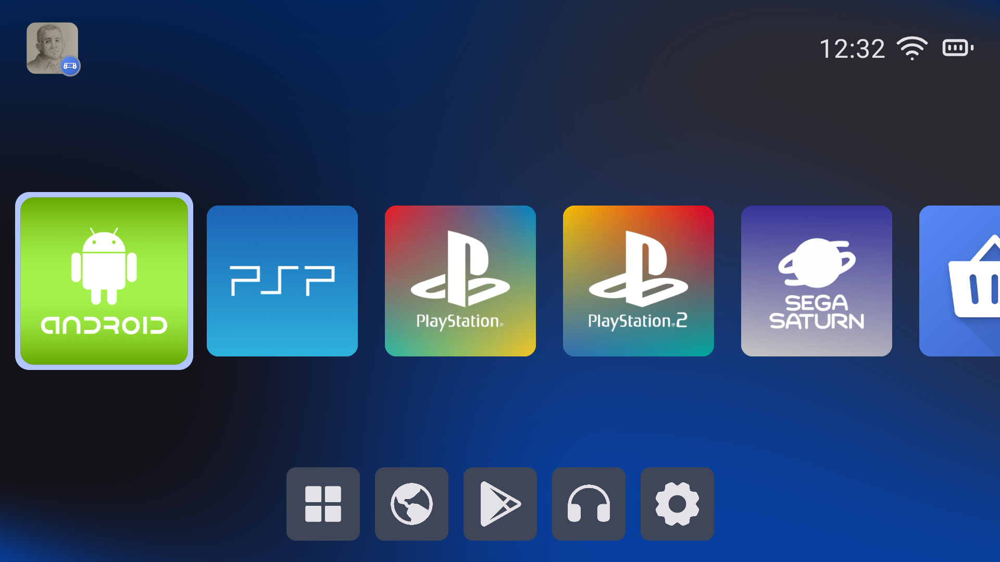
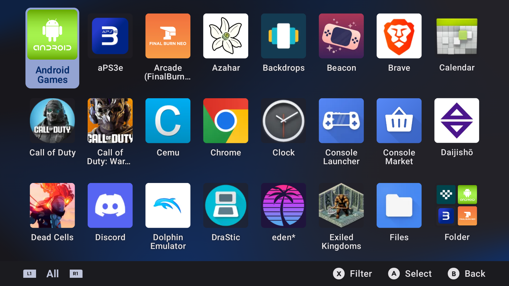
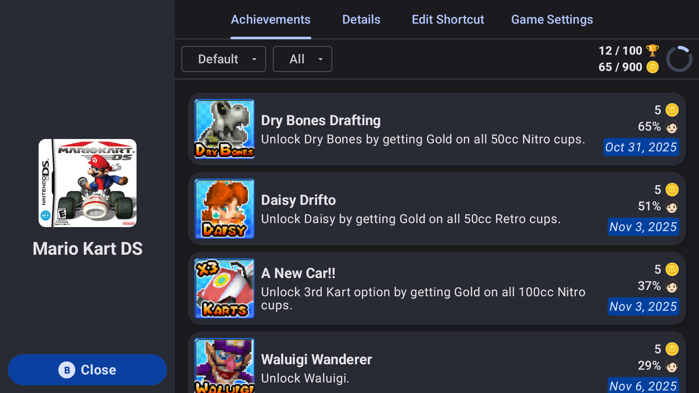

# Console Launcher

**Make your phone look and feel like a handheld game console**

## Features

### Console Experience
- **Console-Style Home UI:** Multiple layouts including Handheld, Immersive, and Grid.
- **Controller Navigation:** Navigate with touch or use your controller with the entire app.
- **Unified Launcher Model:** Launch apps, games, ROM shortcuts, folders, and platform entries from one interface.
- **Guided Onboarding:** Includes a setup flow for making Console Launcher your own.

### Emulation Frontend
- **Broad Compatibility:** Play your legally-acquired game backups with any of the hundreds of supported emulators and platforms.
- **Automatic Library Generation:** Scans your game directories to build platform and game libraries.
- **Extreme Performance:** Supports as many games as you can throw at it with fast loading and navigation.
- **Emulator/Player Management:** Automatically detect installed emulators and RetroArch cores-or find them yourself with the in-app player installer.
- **RetroArch Integration:** Grant folder access, view installed cores, and update/delete cores.

### Shortcuts, Media, and Customization
- **Shortcut Tools:** Edit metadata, set custom images, launch app info, uninstall/remove, and organize into folders.
- **Built-In Media Workflows:** Scrape artwork, search the web for custom artwork, bulk apply/erase images, and customize displayed images with the image role feature.
- **Theme and Visual Customization:** Color themes, theme packs, icon packs, dock icon packs, icon shapes/sizes, and custom wallpapers/background media.
- **Audio and Input Customization:** Custom music, SFX/vibration controls, controller mappings, ABXY swap, and prompt styles.

### Multi-Display Support
- **Deep Customization:** Includes custom display profiles, multiple secondary-screen modex, and configurable launch behavior.
- **Display Rotation:** Easily rotate active screens with the press of the button-no reload required.
- **Samsung DeX Support:** Enable Samsung DeX with the flip of a switch on supported devices.

### RetroAchievements
- **Achievements Viewer:** Browse all of your achievements on a per-platform or per-game basis.
- **Friends List:** View all of your RA friends in a unified list and see what they are playing!

### Discord Integration
- **Rich Presence:** Show your friends what you are playing in real-time.
- **Console Launcher Lobbies:** View private lobbies for Console Launcher players and discuss games with others live.
- **Friend Status and DMs:** Message your friends without leaving the app and see when they go online!
