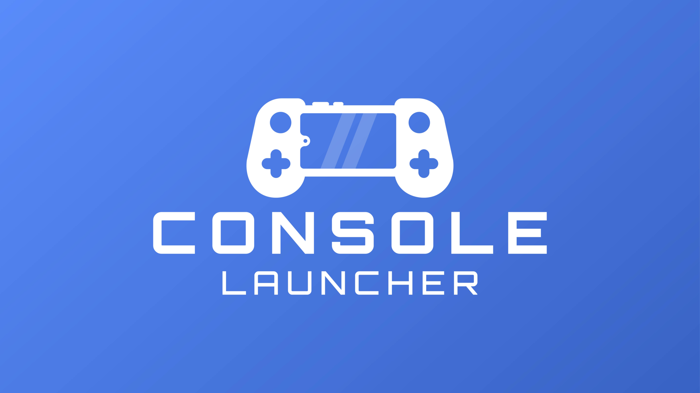

# Console Launcher

**Make your phone look and feel like a handheld game console**

## Emulation Frontend

Console Launcher has an in-development emulation frontend feature that can be found in the GitHub releases page. It lacks many features and often includes bugs (which is why it is not released publically yet). The Console Launcher frontend stands out from others by being extremely simple to setup, supporting customizable scraping, and supporting tens of thousands of games on a single device with minimal slowdown.
